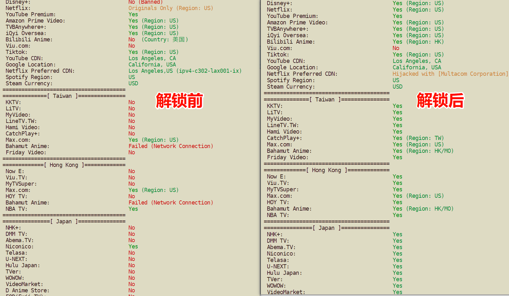

# sniproxy & smartdns 一键配置脚本

> 开源项目：https://github.com/lthero-big/Smartdns_sniproxy_installer

## 写在前面

### 知识

sniproxy：一个透明代理，反向代理流媒体网站（如Netflix），80和443端口不得被占用，且需要开放

smartdns：一个DNS服务器，用来分流DNS域名是否走sniproxy代理


### 必要准备

1. 一台或多台能解锁流媒体的vps，**简称“解锁机”**
2. 没有vps的可以使用免费或付费的dns解锁服务，请注册Alice免费的DNS解锁服务[Alice](https://app.alice.ws/)
3. 一台或多台不能解锁流媒体的vps，**简称“被解锁机”**


### 实现效果

1. 让一台vps同时解锁多个地区的流媒体（美国、新加坡、日本、香港）
2. 实现使用一个节点，同时解锁香港b站，美国油管，新加坡网飞以及日本HBO等




## 参考项目

1. https://github.com/myxuchangbin/dnsmasq_sniproxy_install
2. https://github.com/bingotl/dns_unlock
3. https://github.com/Jimmyzxk/DNS-Alice-Unlock
4. https://www.nodeseek.com/post-180592-1


### 优点

1. smartdns 拥有更快查询和更强的广告过滤等功能
2. 快速添加您想解锁的地区，一键配置，一键修改，不用再使用复杂的编辑功能
3. 快速配置您想添加的解锁机服务器，方便修改
4. 解锁机哪怕宕机也不影响被解锁机正常使用


------


## 脚本下载与安装

### 脚本下载

```sh
wget https://raw.githubusercontent.com/lthero-big/Smartdns_sniproxy_installer/refs/heads/main/smtdns_install.sh -O smtdns_install.sh 
```

脚本将保存在本地 ，命名为smtdns_install.sh ，您可以随时执行

### 脚本执行

```sh
bash smtdns_install.sh
```


------


## 阅读顺序

> 如果您不想配置解锁机，请注册Alice免费的DNS解锁服务[Alice](https://app.alice.ws/)，申请DNS解锁。随后，请阅读“被解锁机”篇章，使用`nameserver`添加DNS服务器。
>
> 如果您有自己的解锁机，可以先阅读“解锁机”篇章，配置自己的解锁机，随后使用`address`添加DNS服务器。


-------


## 被解锁机

### 功能解释

```
-----------被解锁机--------------
1.  安装 SmartDNS
2.  重新配置 SmartDNS
3.  添加上游 DNS 并分组
4.  查看已配置的上游 DNS 组
5.  查看流媒体平台列表
6.  添加一家流媒体平台到 SmartDNS
7.  添加一个地区流媒体到 SmartDNS
8.  添加所有流媒体平台到 SmartDNS
9.  查看已经添加的流媒体
```

1. 输入1，安装smartdns；随后会询问**是否添加上游DNS并分级**
   1. 如果你已经有Alice的解锁服务，或者您自建了DNS服务器，直接输入`y`；
   2. 随后，会被邀请输入**上游服务器ip地址**，以及给它**命名**，简短即可方便区分
      1. 假设输入了`12.23.34.45`，命令为`alice-hk`
   3. 直到输入`N`，完成smartdns的初始配置
2. 输入2，会删除已有的smartdns配置，并重新创建
3. 输入3，会继续添加上游 DNS 
4. 输入6/7/8，添加流媒体平台（注意是一家，一地区，还是所有平台）
   1. 假设输入7，想将香港地区的流媒体，都让`alice-hk`解锁
   2. 请输入`nameserver/address`，如果使用Alice解锁服务，选择`nameserver`
   3. 直到输入`N`，完成地区的添加
5. 输入9，查看已经添加的流媒体及对应的解锁服务器


### 关于nameserver与address选择

1. 如果使用Alice解锁服务，选择nameserver

2. 如果自建的解锁机运行了smartdns，选择address

3. 如果自建的解锁机不运行smartdns，选择address


### 快速上手

第一步：输入1，安装smartdns；随后会询问**是否添加上游DNS并分级**

1. 如果你已经有Alice的解锁服务，或者您自建了DNS服务器，直接输入`y`；
2. 随后，会被邀请输入**上游服务器ip地址**，以及给它**命名**，简短即可方便区分
   1. 假设输入了`12.23.34.45`，命令为`alice-hk`
3. 直到输入`N`，完成smartdns的初始配置

第二步：输入6/7/8，添加流媒体平台（注意是一家，一地区，还是所有平台）

1. 假设输入7，如果使用Alice解锁服务，想将香港地区的流媒体都让`alice-hk`解锁，选择`nameserver`
2. 直到输入`N`，完成地区的添加


**确保smartdns服务启动了即可**

```
SmartDNS 服务状态：运行中
SmartDNS 开机自启：已启用
system DNS 服务状态：已停止
system DNS 开机自启：未启用
sniproxy 服务状态：已停止
sniproxy 开机自启：未启用
```


------


## 解锁机

### 功能解释

```
-----------sniproxy相关(解锁机)--------------
11.  安装并启动 sniproxy
12.  添加流媒体平台到 sniproxy
13.  启动/重启 sniproxy 服务并开机自启
14.  停止 sniproxy 并关闭开机自启
15.  一键对被解锁机放开 80/443/53 端口 
16.  一键开启指定 防火墙(ufw) 端口 
```

1. 输入11，会安装sniproxy并一键添加一些常用的流媒体平台（不会包含所有的）
2. 输入12：添加想要的流媒体平台到 sniproxy，与上面一样，可以选择添加一个平台或一个地区的平台
3. 输入13/14：控制sniproxy服务
4. 输入15：**必做**，防止被他人利用，需要添加对**被解锁机**的访问权限
5. 输入16：额外功能，开启某个防火墙端口


### 快速上手

第一步：输入15，添加对**被解锁机**的访问权限，需要输入**被解锁机的ip**即可

第二步：输入11，会安装sniproxy并一键添加一些常用的流媒体平台

第三步：输入12：添加想要的流媒体平台到 sniproxy；如果你的机器是美国机，则可以添加美国的流媒体服务到sniproxy中，sniproxy会自动重启；

**确保 sniproxy 服务启动即可**

```
SmartDNS 服务状态：已停止
SmartDNS 开机自启：未启用
system DNS 服务状态：运行中
system DNS 开机自启：已启用
sniproxy 服务状态：运行中
sniproxy 开机自启：已启用
```


------


## 高级玩家

前面只让smartDNS运行在了被解锁机上，当然，smartdns可以运行在解锁机上，从而实现**嵌套解锁**。

**嵌套解锁**：将上游的DNS服务器指向DNS商家提供的服务器，从而让解锁机下游的服务器都能享受DNS商家提供的解锁权益（可能会违反商家的规则）

本脚本当然可以使用在解锁机上，下面是解锁机的smartdns配置

```sh
server 13.23.33.43 IP -group sg -exclude-default-group

# 如果解锁机使用解锁机IP，则下游的被解锁机网飞会定位为解锁机的ip（如美国）
address /netflix.com/xx.xx.xx.xx
address /netflix.net/xx.xx.xx.xx
address /nflximg.com/xx.xx.xx.xx
address /nflximg.net/xx.xx.xx.xx
address /nflxvideo.net/xx.xx.xx.xx
address /nflxext.com/xx.xx.xx.xx
address /nflxso.net/xx.xx.xx.xx


#> 如果解锁机使用上游的DNS商家提供的IP，则下游的被解锁机网飞会定位为上游ip（如新加坡）
nameserver /netflix.com/sg
nameserver /netflix.net/sg
nameserver /nflximg.com/sg
nameserver /nflximg.net/sg
nameserver /nflxvideo.net/sg
nameserver /nflxext.com/sg
nameserver /nflxso.net/sg
```

